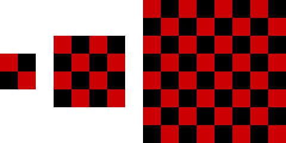
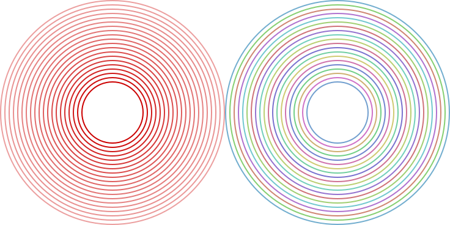
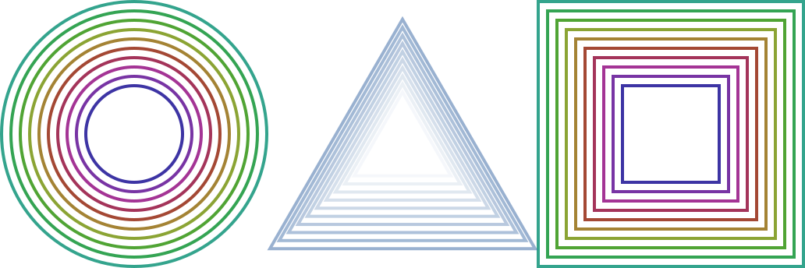

# Creative Elm

Compose drawings in **Elm** - _The purely functional typed approach!_

The drawings and the implementation are based on [Creative Scala](https://github.com/underscoreio/creative-scala).

